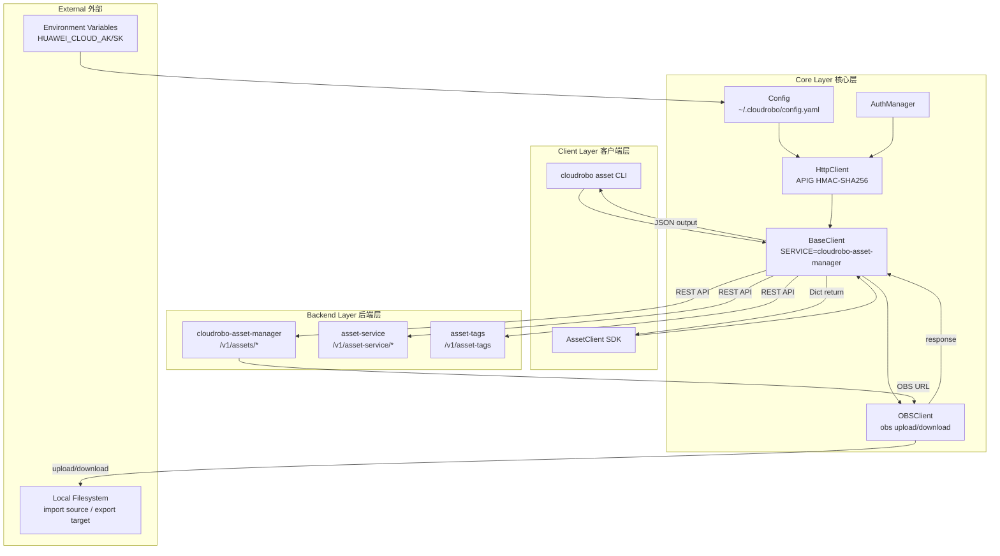
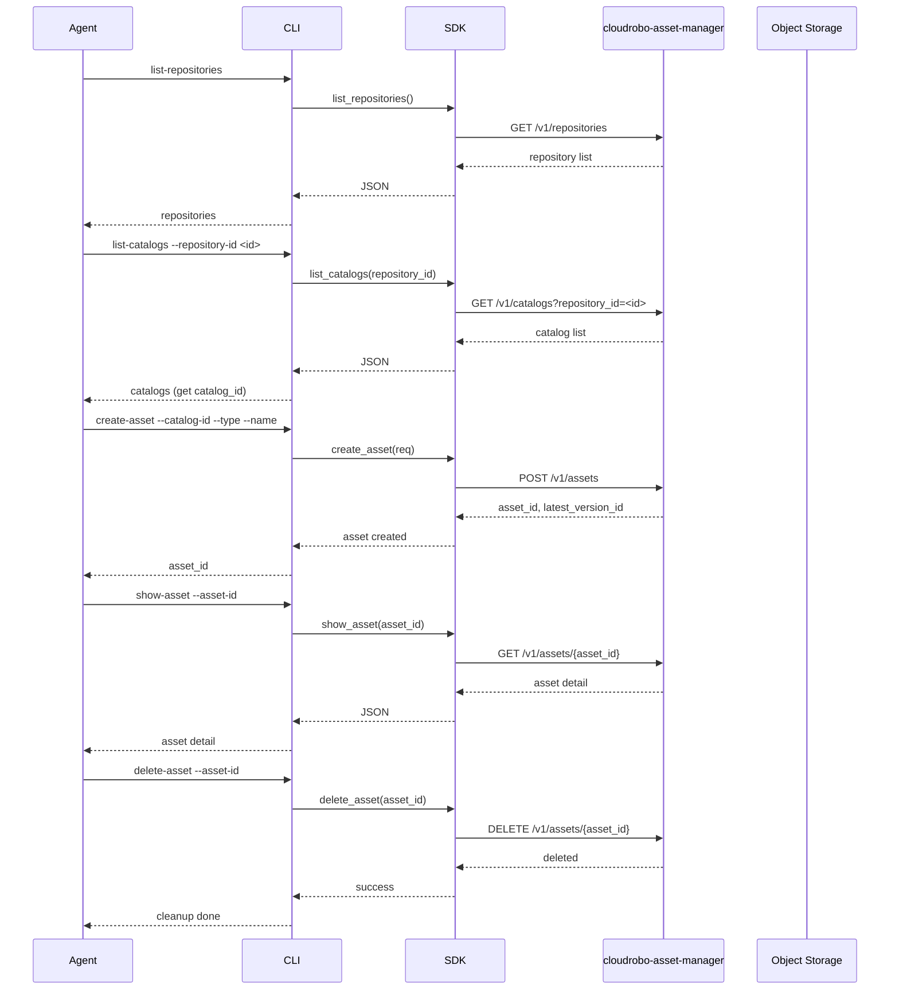
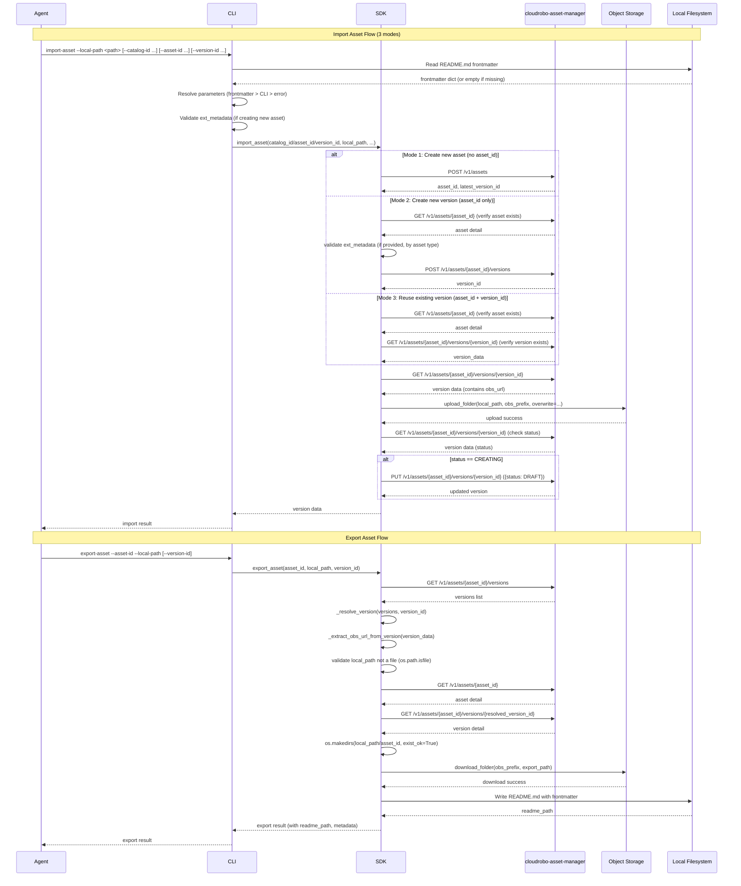
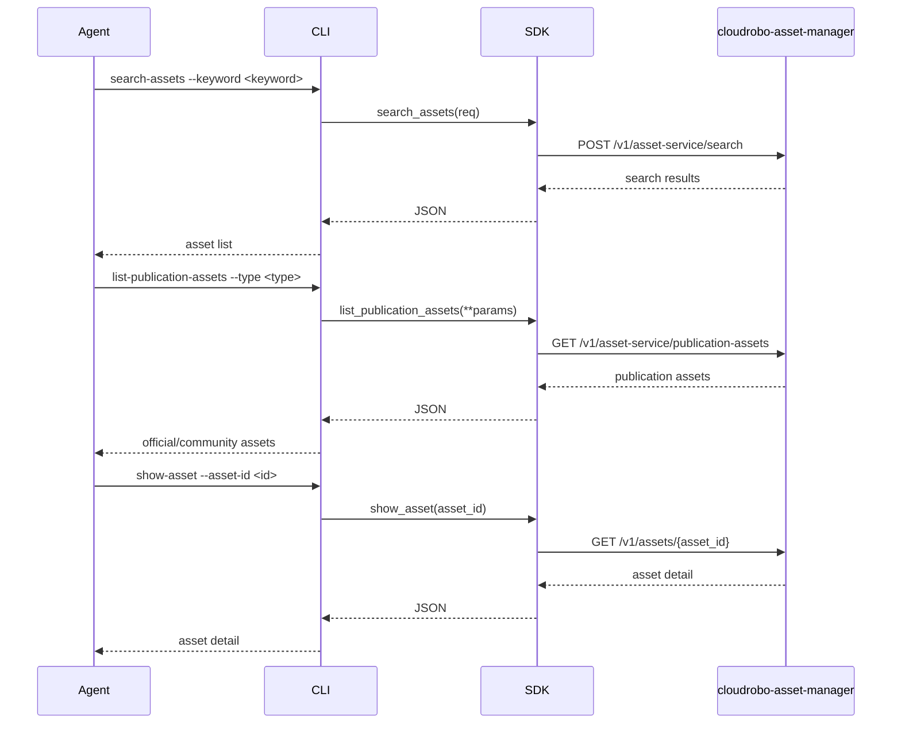

# Dataflow Diagram 数据流图

## Architecture Overview 架构概览

## Asset Lifecycle Flow 资产生命周期流程

## Import/Export Flow 导入导出流程

## Search & Publication Flow 广场搜索流程

## API Path Summary API路径汇总

### Repositories & Catalogs

| Operation | Method | Path |
|-----------|--------|------|
| List repositories | GET | `/v1/repositories` |
| List catalogs | GET | `/v1/catalogs` |
| Show catalog | GET | `/v1/catalogs/{catalog_id}` |

### Assets

| Operation | Method | Path |
|-----------|--------|------|
| Create asset | POST | `/v1/assets` |
| List assets | GET | `/v1/assets` |
| Show asset | GET | `/v1/assets/{asset_id}` |
| Update asset | PUT | `/v1/assets/{asset_id}` |
| Delete asset | DELETE | `/v1/assets/{asset_id}` |
| Batch delete assets | POST | `/v1/assets/batch-delete` |

### Versions

| Operation | Method | Path |
|-----------|--------|------|
| Create version | POST | `/v1/assets/{asset_id}/versions` |
| List versions | GET | `/v1/assets/{asset_id}/versions` |
| Show version | GET | `/v1/assets/{asset_id}/versions/{version_id}` |
| Update version | PUT | `/v1/assets/{asset_id}/versions/{version_id}` |
| Delete version | DELETE | `/v1/assets/{asset_id}/versions/{version_id}` |
| Batch delete versions | POST | `/v1/assets/{asset_id}/versions/batch-delete` |

### Tags

| Operation | Method | Path |
|-----------|--------|------|
| Add tags | POST | `/v1/assets/{asset_id}/tags` |
| Delete tag | DELETE | `/v1/assets/{asset_id}/tags/{tag}` |
| List predefined tags | GET | `/v1/asset-tags` |

### Actions

| Operation | Method | Path |
|-----------|--------|------|
| List actions | GET | `/v1/assets/{asset_id}/versions/{version_id}/actions` |
| Create action | POST | `/v1/assets/{asset_id}/versions/{version_id}/actions` |
| Show action | GET | `/v1/assets/{asset_id}/versions/{version_id}/actions/{action}` |
| Update action | PUT | `/v1/assets/{asset_id}/versions/{version_id}/actions/{action}` |
| Delete action | DELETE | `/v1/assets/{asset_id}/versions/{version_id}/actions/{action}` |

### Permission & Lineage

| Operation | Method | Path |
|-----------|--------|------|
| Check permission | POST | `/v1/assets/{asset_id}/versions/{version_id}/check-permission` |
| Show lineage | GET | `/v1/assets/{asset_id}/versions/{version_id}/tree?type=` |

### Marketplace

| Operation | Method | Path |
|-----------|--------|------|
| Search assets | POST | `/v1/asset-service/search` |
| List publication assets | GET | `/v1/asset-service/publication-assets` |
