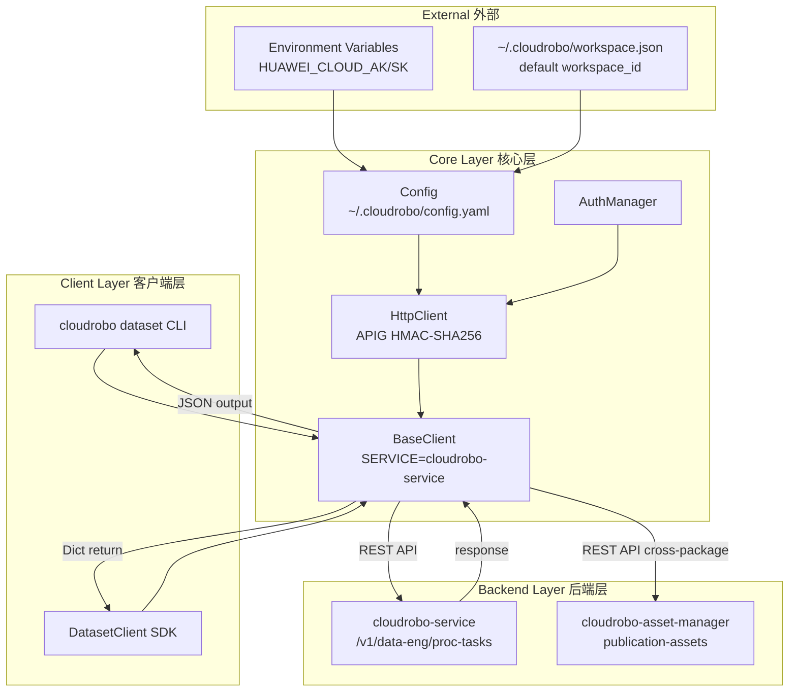
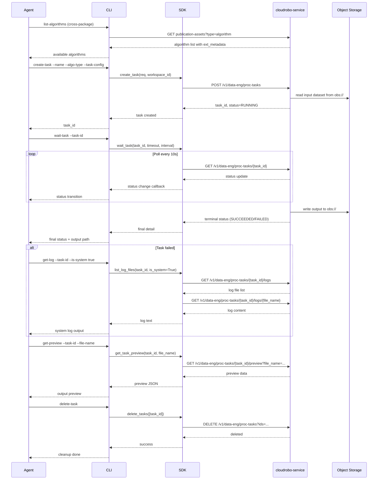
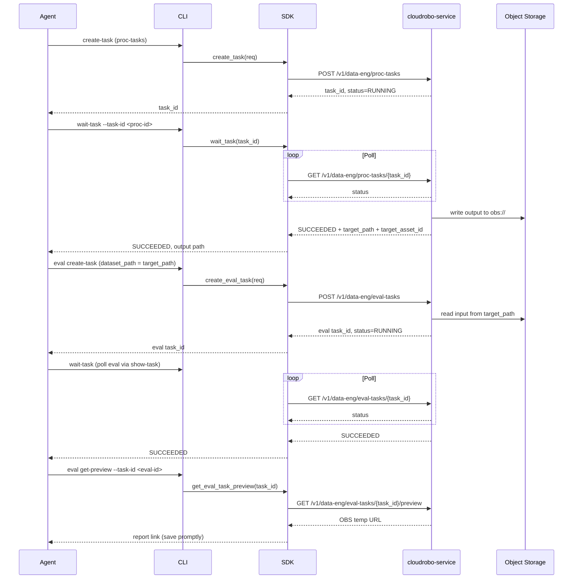

# Dataflow Diagram 数据流图

## Architecture Overview 架构概览



## Task Lifecycle Flow 任务生命周期流程



## Log Retrieval Flow 日志获取流程

```mermaid
flowchart TD
    A[Agent requests logs] --> B{is_system?}
    B -->|true| C[GET /logs?is_system=true]
    B -->|false| D[GET /logs?is_system=false]
    C --> E[Parse file_name + file_path]
    D --> E
    E --> F{--all flag?}
    F -->|no| G[get_task_log_tail<br/>latest 64KB]
    F -->|yes| H[get_task_log<br/>full content]
    G --> I[GET /logs/{file_name}<br/>start_byte=0&end_byte=65536]
    H --> J[GET /logs/{file_name}<br/>start_byte=0&end_byte=1000000]
    I --> K{total_size < 64KB?}
    K -->|yes| L[Return partial content]
    K -->|no| M[GET /logs/{file_name}<br/>start_byte=total-64KB]
    M --> L
    J --> L
    L --> N[Return log content to Agent]
```

## Pipeline Flow (proc-tasks → eval-tasks) 任务编排流程



## API Path Summary API路径汇总

### proc-tasks

| Operation | Method | Path |
|-----------|--------|------|
| Create task | POST | `/v1/data-eng/proc-tasks` |
| List tasks | GET | `/v1/data-eng/proc-tasks` |
| Show task | GET | `/v1/data-eng/proc-tasks/{task_id}` |
| Update task | PATCH | `/v1/data-eng/proc-tasks/{task_id}` |
| Delete tasks | DELETE | `/v1/data-eng/proc-tasks?ids=` |
| Restart task | POST | `/v1/data-eng/proc-tasks/{task_id}/restart` |
| List log files | GET | `/v1/data-eng/proc-tasks/{task_id}/logs` |
| Get log content | GET | `/v1/data-eng/proc-tasks/{task_id}/logs/{file_name}` |
| Download log | GET | `/v1/data-eng/proc-tasks/{task_id}/logs/{file_name}/download` |
| Get frames | GET | `/v1/data-eng/proc-tasks/{task_id}/frames?prefix=` |
| Get preview | GET | `/v1/data-eng/proc-tasks/{task_id}/preview` |

### eval-tasks

| Operation | Method | Path |
|-----------|--------|------|
| Create eval task | POST | `/v1/data-eng/eval-tasks` |
| List eval tasks | GET | `/v1/data-eng/eval-tasks` |
| Show eval task | GET | `/v1/data-eng/eval-tasks/{task_id}` |
| Update eval task | PATCH | `/v1/data-eng/eval-tasks/{task_id}` |
| Delete eval task | DELETE | `/v1/data-eng/eval-tasks/{task_id}` |
| List eval log files | GET | `/v1/data-eng/eval-tasks/{task_id}/logs` |
| Get eval log content | GET | `/v1/data-eng/eval-tasks/{task_id}/logs/{file_name}` |
| Download eval log | GET | `/v1/data-eng/eval-tasks/{task_id}/logs/{file_name}/download` |
| Get eval preview | GET | `/v1/data-eng/eval-tasks/{task_id}/preview` |
