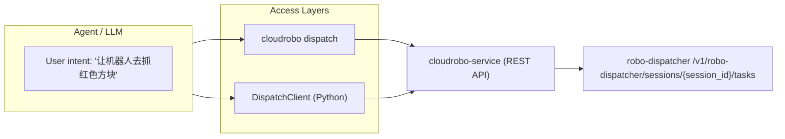
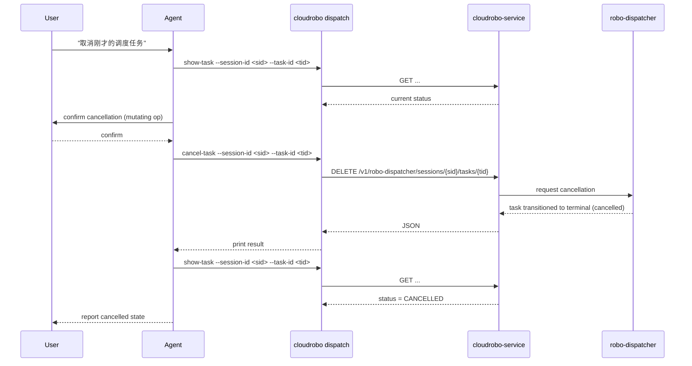
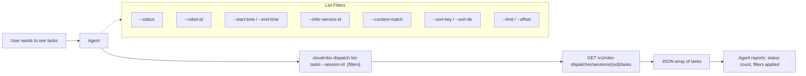
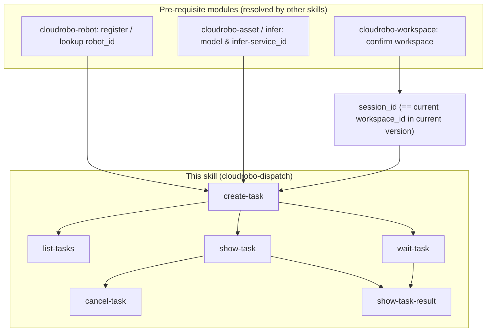

# Dataflow Diagrams — cloudrobo-dispatch

## 1. High-Level Architecture



## 2. Task Dispatching Dataflow

```mermaid
sequenceDiagram
    participant U as User
    participant A as Agent
    participant CLI as cloudrobo dispatch
    participant S as cloudrobo-service
    participant D as robo-dispatcher

    U->>A: "让机器人 R1 去抓红色方块"
    A->>A: resolve session_id (= current workspace_id) + robot_id + exec_model_id + stop condition
    A->>U: confirm task config (mutating op)
    U-->>A: confirm
    A->>CLI: create-task --session-id <sid> --name ... --task "..." --constraints-json '{"model":{...},"robot_id":...,"exec_constraints":{...}}'
    CLI->>S: POST /v1/robo-dispatcher/sessions/{sid}/tasks
    S->>D: forward request
    D-->>S: created task (task_id, status=PENDING)
    S-->>CLI: JSON {task_id, status}
    CLI-->>A: print result
    A->>CLI: wait-task --session-id <sid> --task-id <tid> [--timeout 600]  (blocks; polls every 5s)
    CLI->>S: GET /v1/robo-dispatcher/sessions/{sid}/tasks/{tid}  (repeated internally every 5s)
    S-->>CLI: task detail + status (RUNNING ... COMPLETED/FAILED/CANCELLED)
    Note over A,CLI: wait-task returns once status != RUNNING (no manual 20-30s polling loop)
    A->>CLI: show-task-result --session-id <sid> --task-id <tid>
    CLI->>S: GET /v1/robo-dispatcher/sessions/{sid}/tasks/{tid}/result
    S-->>CLI: {task, log_items}
    CLI-->>A: print result + logs
    A-->>U: summarize outcome
```

## 3. Task Cancellation Dataflow



## 4. Task Listing & Filtering Dataflow



## 5. Cross-Module Orchestration Dataflow



> **Note**: This skill does not call other skills by name. The agent orchestrates across
> skills: it uses `cloudrobo-robot`/`cloudrobo-asset`/`cloudrobo-infer` first to resolve
> `robot_id`, model / `exec_model_id`, and `infer-service_id`, then uses this dispatch skill
> to create and monitor the dispatcher task.
