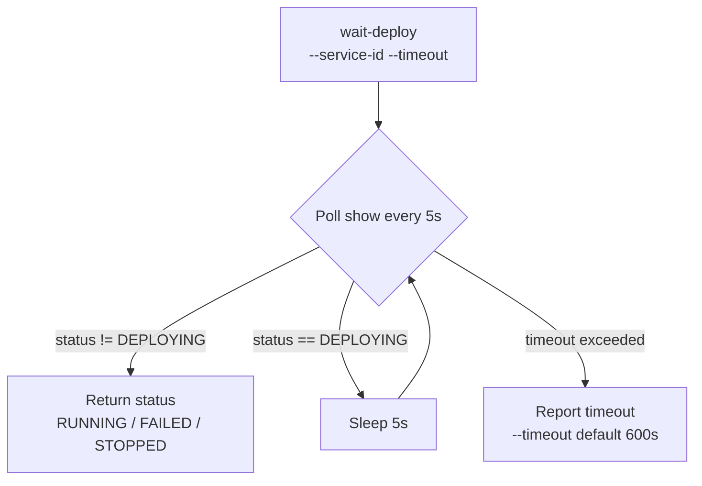
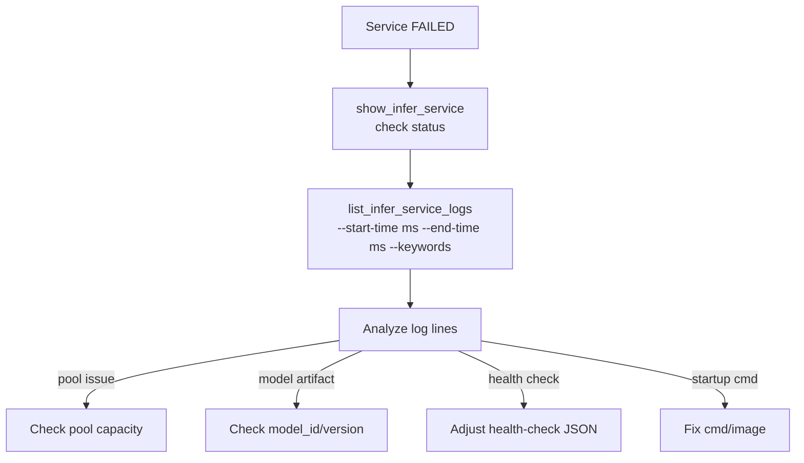
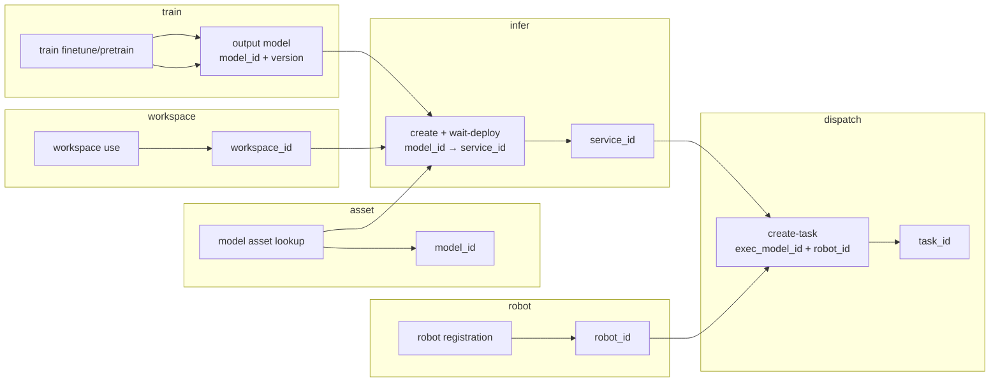

# Dataflow Diagram

## High-Level Architecture

```mermaid
flowchart TD
    User[User Request] --> Trigger[Skill Trigger Matching]
    Trigger --> Route[Capability Domain Routing]
    Route --> CLI[cloudrobo infer CLI]
    CLI --> InferPkg[cloudrobo-infer SDK]
    InferPkg --> InferAPI[cloudrobo-service API /v1/infer-services]
    InferPkg --> AssetAPI[cloudrobo-asset-manager (model lookup)]
    InferAPI --> Pool[ModelArts Compute Pool]
    InferAPI --> Logs[(OBS Logs)]
```

## Model Deployment Dataflow

```mermaid
flowchart LR
    subgraph Prepare
        P1[Resolve workspace<br/>workspace current / list + use] --> P2[Query model<br/>list-publication-assets --type model<br/>--actions ONLINE_DEPLOYMENT --action-status ENABLE<br/>or list-assets --catalog-id --type model]
        P2 --> P3[Resolve version<br/>show-asset → latest_version_id]
        P3 --> P4[Resolve pool + flavor<br/>resource list-pools --resource-type MODELARTS]
    end
    subgraph Discover
        D1[show-asset model<br/>get actions[]] --> D2{ONLINE_DEPLOYMENT<br/>action exists?}
        D2 -->|Yes| D3[show-asset algorithm<br/>extract cmd/image/envs/deployment_config]
        D2 -->|No| D4[Bare model<br/>ask user for optional params]
        D3 --> D5[download-url<br/>skill_config.json]
        D5 --> D6[download-url<br/>r2c_config.yaml → r2c.json]
        D6 --> D7[Assemble full create command]
        D4 --> D7
    end
    subgraph Execute
        E1[create_infer_service<br/>POST /v1/infer-services] --> E2[wait-deploy<br/>Poll show every 5s]
        E2 --> E3[RUNNING / FAILED]
    end
    subgraph Consume
        X1[infer_service_id used by<br/>dispatch embodied tasks]
    end
    P4 --> D1
    D7 --> E1
    E3 --> X1
```

> **Discover subgraph** applies only to space asset / custom models.
> Embodiment plaza models skip discovery (parameters pre-configured).
> Config files take precedence over ext_metadata fields.

## Wait-Deploy Dataflow (CLI convenience)



> **Note**: `wait-deploy` does NOT create the service. Call `create` first, then `wait-deploy`.
> Do NOT call `start` after `create` — the service auto-deploys (CREATING → DEPLOYING → RUNNING).
> `start` is only for restarting a `STOPPED` service.

## Log Diagnosis Dataflow



## Start/Stop Dataflow

```mermaid
flowchart LR
    Ctrl[stop / start command] --> Svc[POST /v1/infer-services/{id}/stop<br/>POST /v1/infer-services/{id}/start]
    Svc --> Poll[Poll show]
    Poll -->|STOPPED / RUNNING| Terminal[Terminal state]
```

## Cross-Module Dataflow (train → infer → dispatch → robot)



> Inference services consume models produced by train/asset and expose a `service_id` that the
> dispatch module may reference when orchestrating embodied tasks on a robot.
