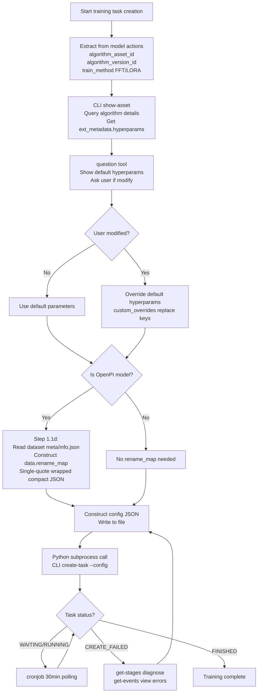
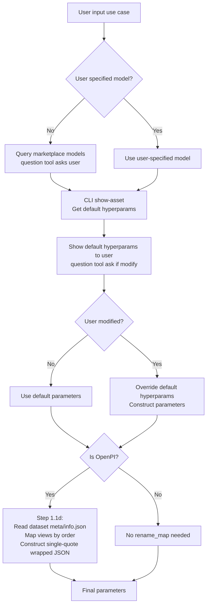

# Data Flow Diagram — CloudRobo Model Workflow

## Full Pipeline Overview

```mermaid
flowchart TD
    subgraph Stage0[Stage 0: Use Case Parsing]
        S0A[User natural language input] --> S0B[Extract robot type + task description]
        S0B --> S0C{User specified model?}
        S0C -->|No| S0D[list-publication-assets<br/>Query marketplace models<br/>question tool asks user]
        S0C -->|Yes| S0E[Use user-specified model]
        S0D --> S0F[Parse dataset source]
        S0E --> S0F
    end

    subgraph Stage1[Stage 1: Asset Query & Dataset Processing]
        S1A[CLI search-assets<br/>Query base model] --> S1A2[Extract from model actions<br/>algorithm + train_method]
        S1A2 --> S1A3[CLI show-asset<br/>Query algorithm details<br/>Get hyperparams]
        S1A3 --> S1A4[question tool<br/>Show default hyperparams<br/>Ask user if modify]
        S1A4 --> S1B[Process dataset<br/>import-asset / search-assets<br/>update-version --status RELEASE]
    end

    subgraph Stage2[Stage 2: Model Training]
        S2A[Construct parameters<br/>Default or custom hyperparams]
        S2A --> S2B[Write JSON to file<br/>Python subprocess call<br/>CLI create-task --config]
        S2B --> S2C[CLI show-task polling<br/>30min cronjob]
        S2C --> S2D{Terminal state?}
        S2D -->|FINISHED| S2E[Extract output_models<br/>model_asset_id + version_id]
        S2D -->|FAILED| S2F[Fault recovery<br/>get-stages / get-events]
        S2F --> S2B
    end

    subgraph Stage3[Stage 3: Inference Deployment]
        S3A[CLI resource list-pools<br/>Query available pools] --> S3B[Select r2c template<br/>Read dataset meta/info.json<br/>Construct model_ext_metadata<br/>OpenPI: 3 fixed camera keys]
        S3B --> S3C[CLI infer create<br/>Pass --model-ext-metadata<br/>Create inference service]
        S3C --> S3D[CLI infer show polling<br/>30min cronjob]
        S3D --> S3E{RUNNING?}
        S3E -->|Yes| S3F[Extract service_id]
        S3E -->|No/Timeout| S3G[Fault recovery<br/>infer start retry]
        S3G --> S3C
    end

    subgraph Stage4[Stage 4: Real-Robot Evaluation]
        S4A[CLI robot list<br/>Query all robots] --> S4A2{Online robots found?}
        S4A2 -->|Yes| S4A3[question tool<br/>3 options:<br/>use online / bring offline online / register new]
        S4A2 -->|No| S4A4[question tool<br/>offline or register new]
        S4A3 -->|Use online| S4A5[robot show verify ONLINE]
        S4A3 -->|Bring offline online| S4A6[robot show → export-certificate<br/>guide onboarding → poll until ONLINE]
        S4A3 -->|Register new| S4A7[ask details → robot create<br/>export-certificate → onboarding → poll]
        S4A4 -->|Select offline| S4A6
        S4A4 -->|Register new| S4A7
        S4A5 --> S4B[session_id = workspace_id<br/>No create-session needed]
        S4A6 --> S4B
        S4A7 --> S4B
        S4B --> S4C[CLI dispatch create-task<br/>Creates AND executes task]
        S4C --> S4D[CLI show-task polling<br/>30min cronjob]
        S4D --> S4E{COMPLETED?}
        S4E -->|Yes| S4F[View execution logs<br/>Get results]
        S4E -->|FAILED/CANCELLED| S4G[Fault recovery]
        S4G --> S4C
    end

    subgraph Stage5[Stage 5: Result Output]
        S5A[Summarize evaluation results<br/>Score + report + full pipeline IDs]
    end

    S0F --> S1A
    S1B --> S2A
    S2E --> S3A
    S3F --> S4A
    S4F --> S5A
```

## Training Task Creation Decision Flow

## Hyperparameter Management Decision Flow

## Long-Running Async Execution & Checkpoint Recovery

```mermaid
flowchart TD
    subgraph Submit Phase
        A1[Stage 2: CLI create-task] --> A2[Save pipeline state<br/>task_id + current_stage=2]
        A3[Stage 3: CLI infer create] --> A4[Save pipeline state<br/>service_id + current_stage=3]
        A5[Stage 4: CLI dispatch] --> A6[Save pipeline state<br/>session_id + current_stage=4]
    end

    subgraph Polling Strategy
        B1[Training polling<br/>cronjob 30min / 72h timeout<br/>CLI show-task] --> B2{FINISHED?}
        B2 -->|Yes| B3[Enter Stage 3]
        B2 -->|No| B1
        B3 --> B4[Inference polling<br/>cronjob 30min / 2h timeout<br/>CLI infer show]
        B4 --> B5{RUNNING?}
        B5 -->|Yes| B6[Enter Stage 4]
        B5 -->|No| B4
        B6 --> B7[Evaluation polling<br/>cronjob 30min / 1h timeout<br/>CLI show-task]
        B7 --> B8{COMPLETED?}
        B8 -->|Yes| B9[Enter Stage 5<br/>Output results]
        B8 -->|No| B7
    end

    subgraph Checkpoint Recovery
        C1[Session interrupted] --> C2[Read pipeline state]
        C2 --> C3[Query current_stage<br/>corresponding task status]
        C3 --> C4{Task status?}
        C4 -->|In progress| C5[Continue polling]
        C4 -->|Completed| C6[Enter next stage]
        C4 -->|Failed| C7[Fault recovery]
        C5 --> C4
    end

    A2 --> B1
    A4 --> B4
    A6 --> B7
```

## Fault Recovery Flow

```mermaid
flowchart TD
    subgraph Training Failure
        TF[Task FAILED/CREATE_FAILED] --> TF1[CLI get-stages<br/>Locate failed stage]
        TF1 --> TF2[CLI get-events --level Error<br/>View error events]
        TF2 --> TF3{Root cause?}
        TF3 -->|Dataset not ready| TF4[update-version --status RELEASE<br/>Publish dataset version]
        TF3 -->|Name conflict| TF5[Use timestamp suffix<br/>Ensure uniqueness]
        TF3 -->|Missing fields| TF6[Check request body<br/>algorithm/output_models etc.]
        TF3 -->|OOM| TF7[Reduce batch_size<br/>or increase spec]
        TF4 --> TFR[CLI create-task<br/>Create new training task]
        TF5 --> TFR
        TF6 --> TFR
        TF7 --> TFR
    end

    subgraph Inference Failure
        IF[Service FAILED] --> IF1[CLI infer show<br/>Check details]
        IF1 --> IF0[CLI infer start<br/>Retry deployment<br/>FAILED to DEPLOYING]
        IF0 --> IF1R{Running after retry?}
        IF1R -->|Yes| IFS[Deployment success]
        IF1R -->|No| IF2{Root cause?}
        IF2 -->|pool_id format| IF3[Use pool-uuid format<br/>with pool- prefix]
        IF2 -->|Missing model_ext_metadata| IF4[Select r2c template<br/>Read dataset meta/info.json<br/>Construct model_ext_metadata<br/>Pass via --model-ext-metadata]
        IF2 -->|skill_config 400| IF6[Use strict:false<br/>or provide skills]
        IF2 -->|Pool full| IF5[Wait for release<br/>or switch pool]
        IF3 --> IFR[CLI infer create<br/>Create new service]
        IF4 --> IFR
        IF5 --> IFR
        IF6 --> IFR
    end

    subgraph Evaluation Failure
        EF[Task FAILED] --> EF1[CLI show-task<br/>Check details]
        EF1 --> EF2{Root cause?}
        EF2 -->|Robot offline| EF3[Check robot status<br/>Ensure ONLINE]
        EF2 -->|Service stopped| EF4[Restart inference service]
        EF2 -->|Task timeout| EF5[Adjust stop_condition]
        EF2 -->|Missing skill_config| EF6[Recreate service<br/>with skill_config]
        EF3 --> EFR[Create new task<br/>to retry]
        EF4 --> EFR
        EF5 --> EFR
        EF6 --> EFR
    end
```

