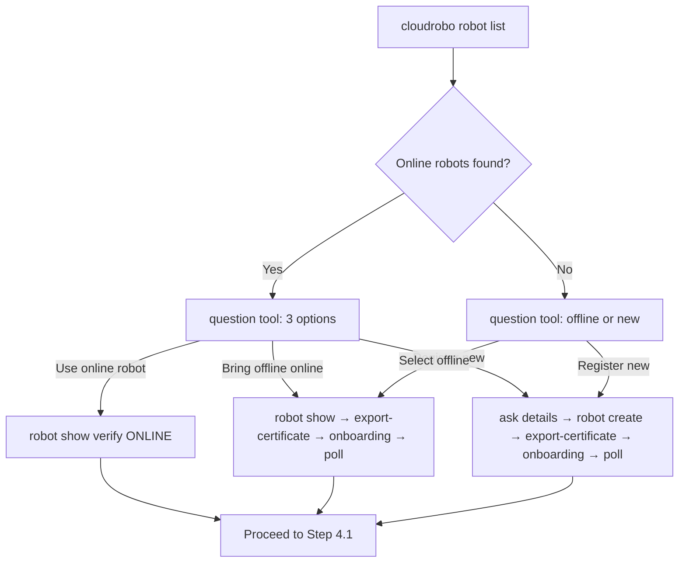

# Robot Selection Guide — Stage 4.0 Detailed Steps

> This document provides detailed steps for the three robot selection options presented in Step 4.0 of the model workflow SKILL.md.

## Prerequisites

- Inference service is `RUNNING` (Stage 3 complete)
- `workspace_id` is set via `cloudrobo workspace use <id>`
- `cloudrobo robot list --workspace-id <workspace_id>` has been executed and results are available

## Option A: Use This Online Robot (Recommended)

When the user selects an online robot that was found in the query results:

1. **Extract robot_id** from the selected robot's `id` field
2. **Verify** — `cloudrobo robot show --robot-id <robot_id>` to confirm current status is still `ONLINE`
3. **Proceed** to Step 4.1 with the confirmed `robot_id`

> Robot state is dynamic; always re-confirm with `show` right before proceeding, even if `list` showed ONLINE moments ago.

## Option B: Select an Offline Robot to Bring Online

When the user chooses to bring an offline robot online:

### Step B.1: Confirm Robot Details

```bash
cloudrobo robot show --robot-id <robot_id>
```

Display robot details (name, type, manufacturer, model, current status) to the user for confirmation.

### Step B.2: Export Access Certificate

```bash
mkdir -p ./certs
cloudrobo robot export-certificate --robot-id <robot_id> --output ./certs
# Output: ./certs/cert_config_{robot_name}_{timestamp}.zip
```

> **Security**: The exported `cert_config_*.zip` is a credential bundle. Store it securely and never commit to source control.
> If export returns `CloudRobo.04010007 "The robot can only have one running job"`, the robot currently has a running job — wait for it to finish or select a different robot.

### Step B.3: Guide Robot-Side Onboarding

Provide the user with the following guidance:

1. Deploy `access-config.zip` to the robot's onboarding directory
2. Ensure the robot has `r2c_sdk` installed (query latest SDK if needed: `cloudrobo robot show-sdk`)
3. Start the robot-side client with the access config — the robot will connect to the platform and transition to `ONLINE`

### Step B.4: Poll Robot Status Until ONLINE

```bash
cloudrobo robot show --robot-id <robot_id>
```

- `ONLINE` → proceed to Step 4.1 with this `robot_id`
- `OFFLINE`/`INACTIVE` → continue polling (suggest 1-minute intervals, 30-minute timeout)
- `REGISTERED` → robot has not yet started the client-side onboarding; ask user to complete Step B.3

> If the robot does not come online within a reasonable timeout, suggest the user verify the robot-side configuration and network connectivity.

## Option C: Register a New Robot

When the user chooses to register a new robot:

### Step C.1: Collect Robot Information

Use the question tool to ask the user for:

| Parameter | Required | Description | Example |
|-----------|----------|-------------|---------|
| `name` | Yes | Robot name (globally unique) | `so101-eval-001` |
| `type` | Yes | Uppercase enum: HUMANOID/QUADRUPED/ARM/OPERATION/WHEELED/OTHER | `ARM` |
| `manufacturer` | Yes | Robot manufacturer | `SO-101` |
| `robot_model` | Yes | Robot model identifier | `SO-101` |
| `description` | No | Optional description | `Evaluation robot for pen insertion task` |

> The `type` should match the robot type parsed in Stage 0 (e.g., `ARM` for so101/jaka/franka).

### Step C.2: Register Robot

```bash
cloudrobo robot create --name <robot_name> --type <TYPE> --manufacturer <manufacturer> --robot-model <robot_model> --workspace-id <workspace_id> [--description "<description>"]
```

> **Confirm before executing** — this is a mutating operation. Extract `id` → `robot_id` from the response.

### Step C.3: Export Access Certificate

```bash
mkdir -p ./certs
cloudrobo robot export-certificate --robot-id <robot_id> --output ./certs
# Output: ./certs/cert_config_{robot_name}_{timestamp}.zip
```

### Step C.4: Guide Robot-Side Onboarding

Same as Step B.3 — deploy the `cert_config_*.zip` on the robot, install `r2c_sdk`, start the client.

### Step C.5: Poll Robot Status Until ONLINE

Same as Step B.4 — poll `cloudrobo robot show --robot-id <robot_id>` until `status` = `ONLINE`.

## Decision Flow Summary



## Common Issues

| Issue | Cause | Fix |
|-------|-------|-----|
| Robot stays `OFFLINE` after onboarding | Robot-side client not started or network issue | Verify `access-config.zip` deployed correctly; check robot network; verify `r2c_sdk` running |
| Robot stays `REGISTERED` | Onboarding not initiated | Guide user through Steps B.3/C.4 |
| `export-certificate` returns 400 | Robot has a running job | Wait for job to finish, or select an INACTIVE/idle robot |
| `robot create` fails | Name not unique | Use timestamp suffix for uniqueness |
| Robot type mismatch with model | Wrong `type` selected | Ensure `type` matches Stage 0 robot type (e.g., `ARM` for so101) |
