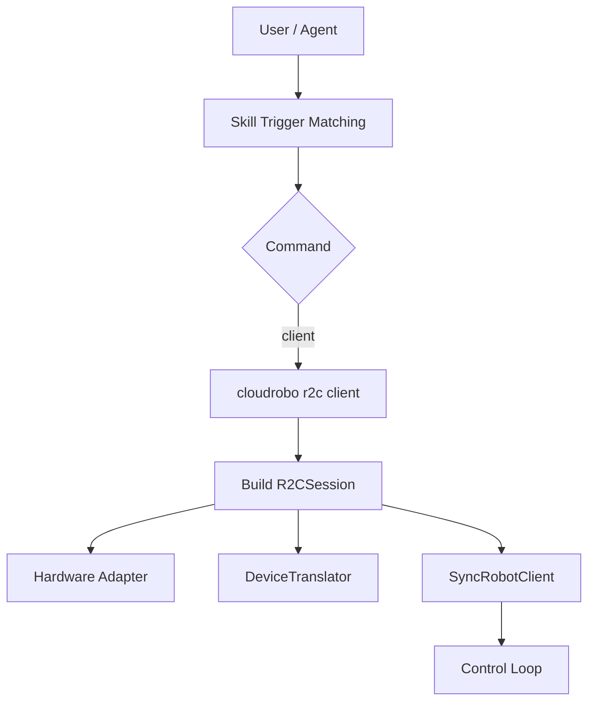
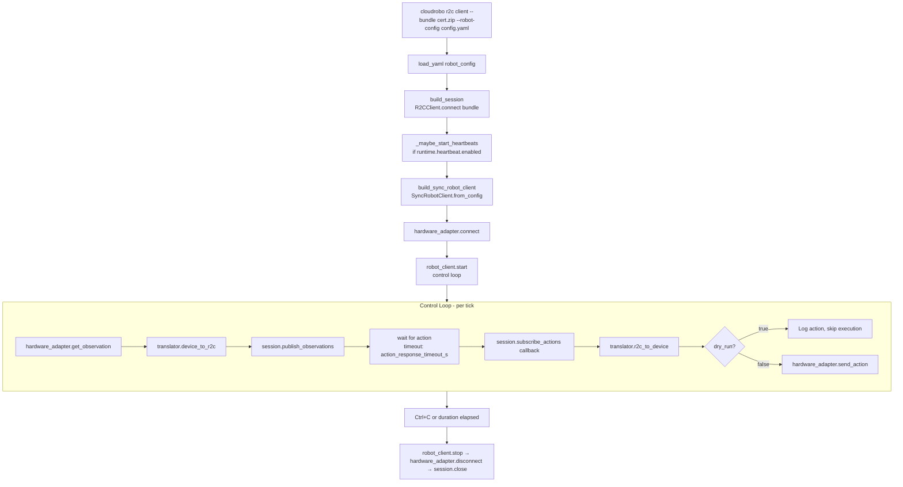
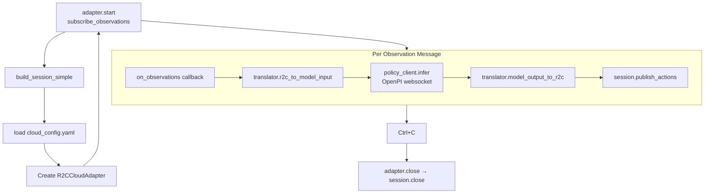
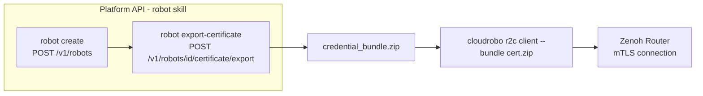
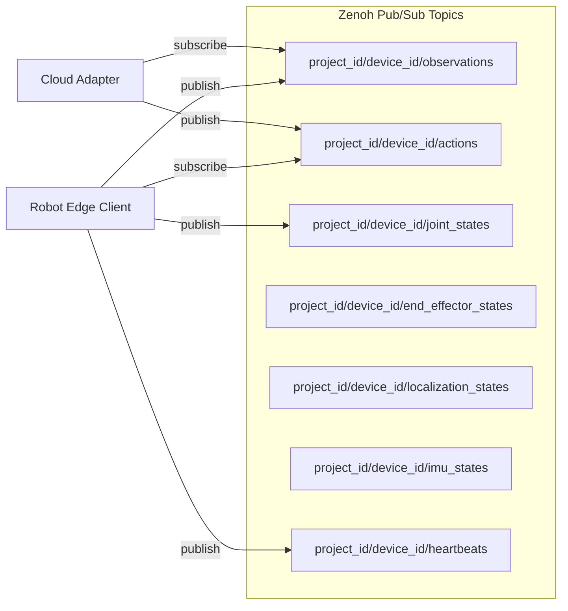
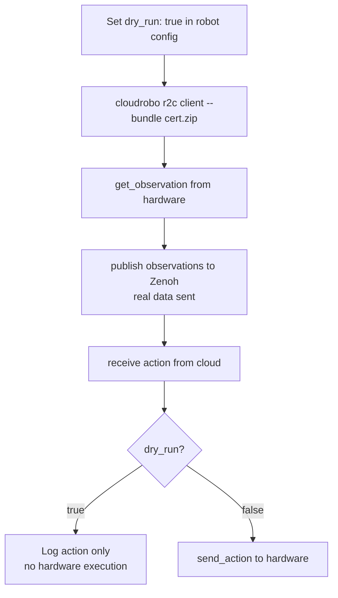
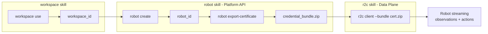

# Dataflow Diagram

## High-Level Architecture

> `cloudrobo r2c` exposes a single subcommand, `r2c client`. The cloud-side OpenPI adapter is
> a Python module/example (`inference/r2c_cloud_adapter.py`), not a CLI subcommand, and is out
> of scope for this skill.

## Robot Edge Client Dataflow

## Cloud Adapter Dataflow (SDK, out of CLI scope)

The cloud-side OpenPI adapter is NOT a `cloudrobo r2c` CLI subcommand. It is a Python module
(`inference/r2c_cloud_adapter.py`) and example scripts (`examples/*_cloud_adapter.py`). For
reference, its dataflow is:

## Credential Bundle Dataflow

## Zenoh Topic Structure

## Dry-Run Testing Dataflow

## Cross-Skill Orchestration

> The r2c skill depends on the robot skill for credential bundle production and the workspace
> skill for workspace context. The agent orchestrates across skills: register robot → export
> certificate → start r2c client (config is validated automatically at client startup).
