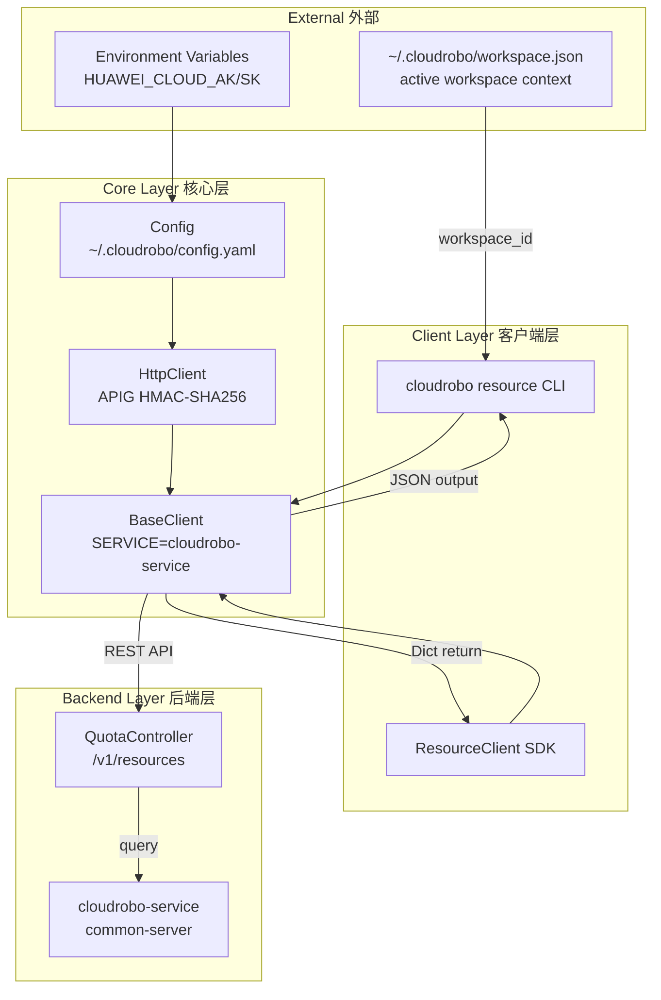
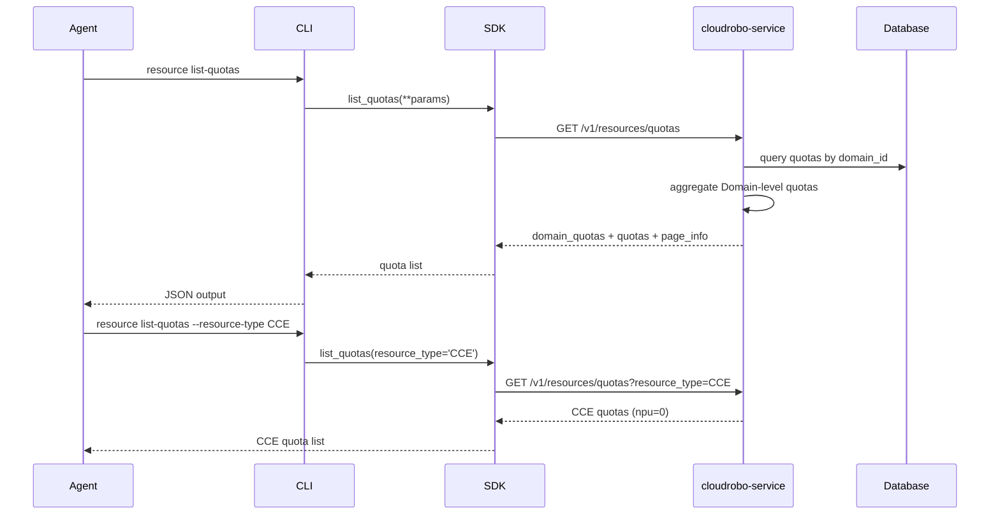
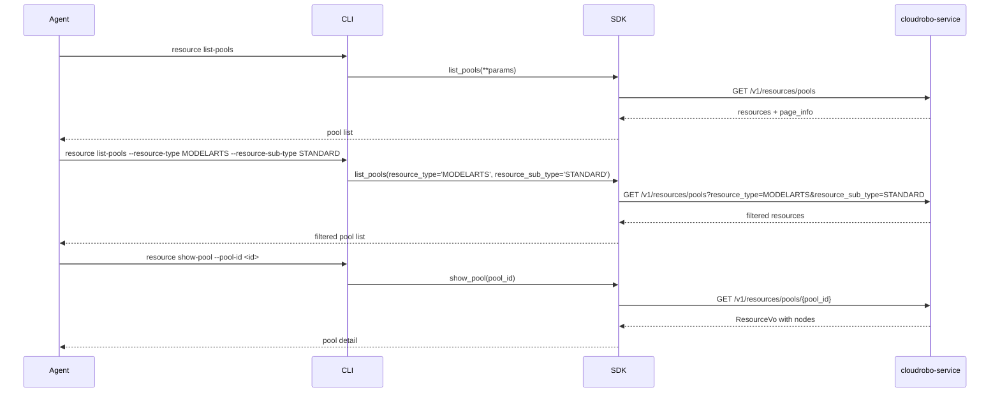

# Dataflow Diagram 数据流图

## Architecture Overview 架构概览

## Quota Query Flow 配额查询流程

## Resource Pool Query Flow 资源池查询流程

## API Path Summary API路径汇总

| Operation | Method | Path |
|-----------|--------|------|
| List quotas | GET | `/v1/resources/quotas` |
| List pools | GET | `/v1/resources/pools` |
| Show pool | GET | `/v1/resources/pools/{pool_id}` |
