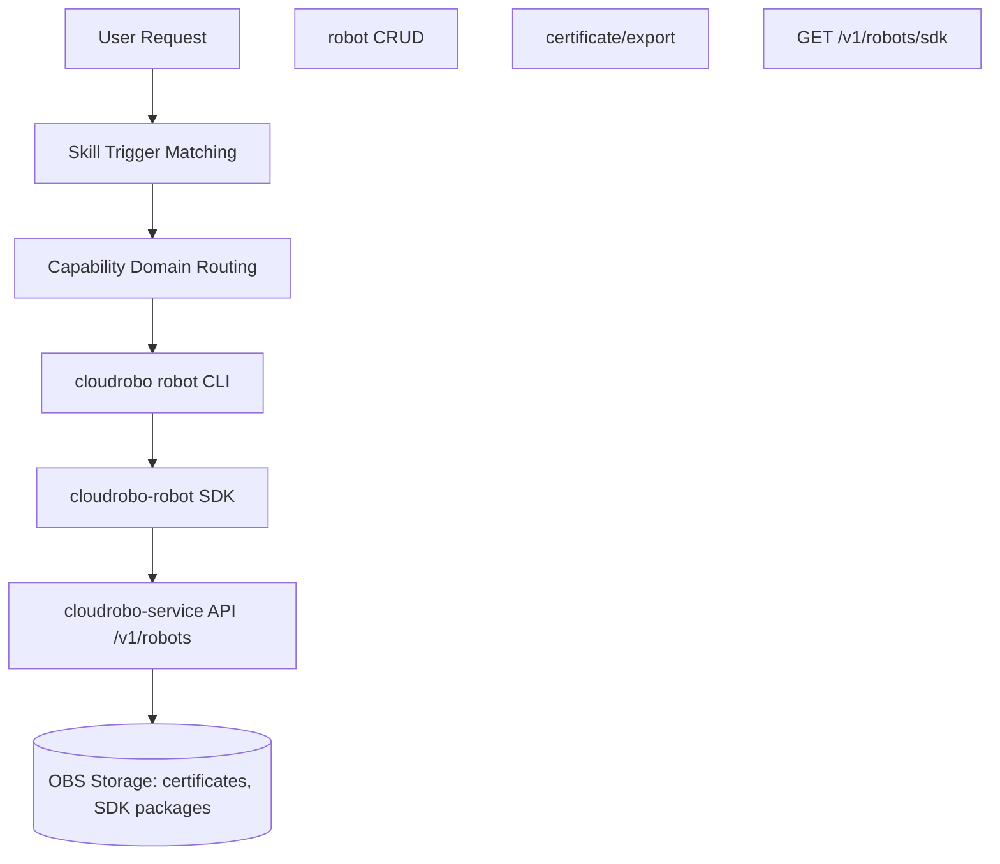
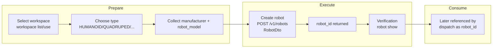
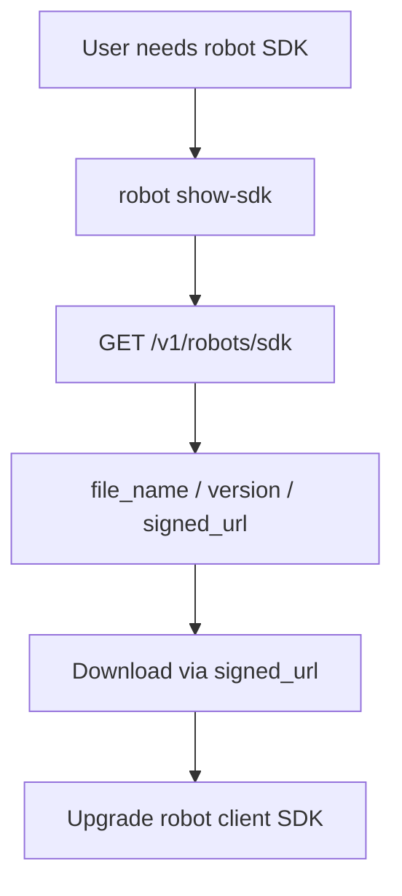
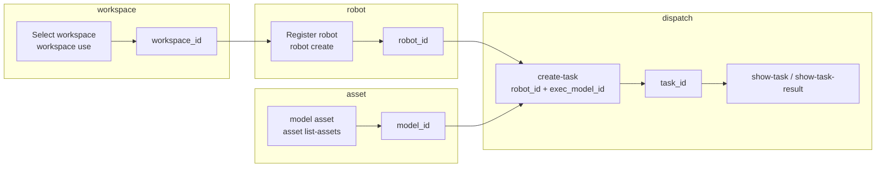

# Dataflow Diagram

## High-Level Architecture



## Robot Registration Dataflow



## Certificate Export Dataflow

```mermaid
flowchart TD
    Start[User requests access config / certificate<br/>下载/导出配置文件] --> Cmd[robot export-certificate<br/>--robot-id [--password] --output <directory>]
    Cmd --> ShowRobot[show_robot<br/>get robot name]
    ShowRobot --> Validate[validate_safe_id<br/>robot_id path check]
    Validate --> API[POST /v1/robots/{robot_id}/certificate/export<br/>body: {password, optional}]
    API --> Binary[Access-config zip binary returned]
    Binary --> Write[CLI auto-generates filename<br/>cert_config_{name}_{timestamp}.zip<br/>writes to --output directory in wb mode]
    Write --> Done[Access-config zip on disk - store securely]
```

## SDK Upgrade Dataflow



## Cross-Module Dataflow (dispatch + asset + workspace)



> Robot registration produces the `robot_id` consumed by the dispatch module to target a physical
> robot. The workspace_id comes from the workspace skill; model IDs come from the asset skill.
