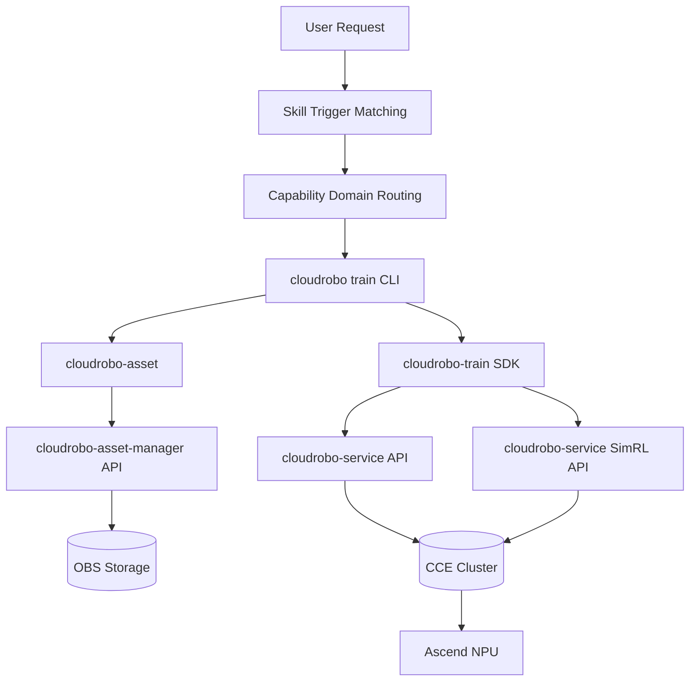
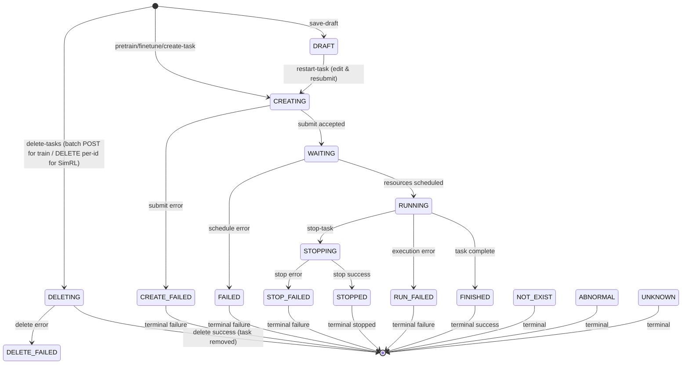
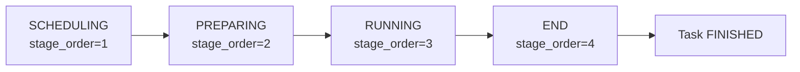
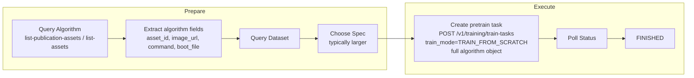
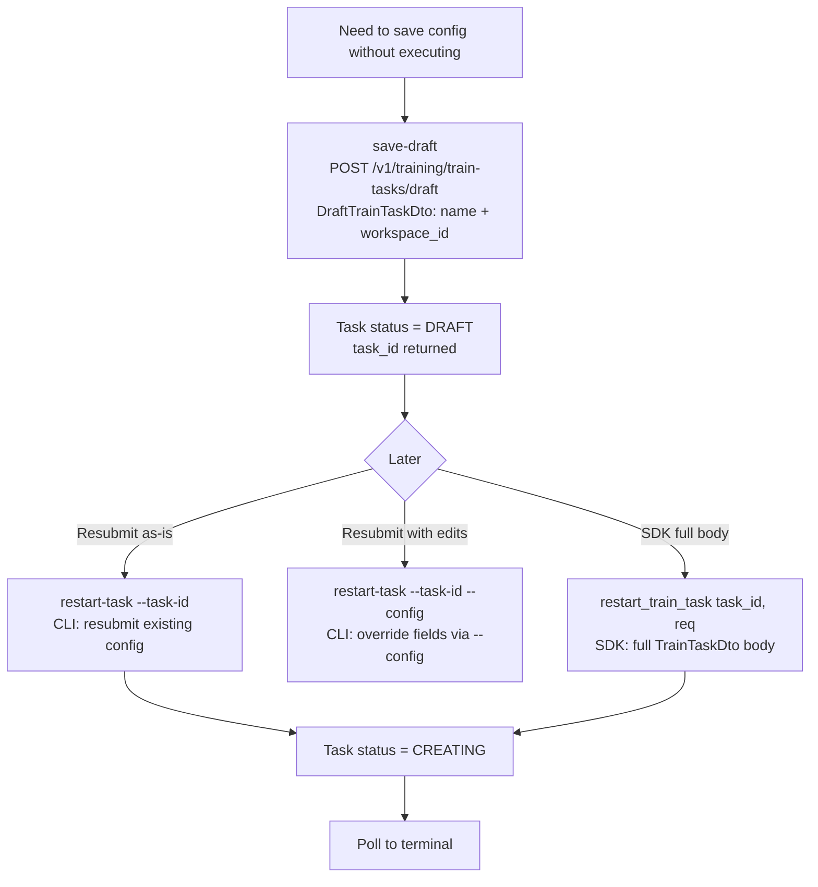
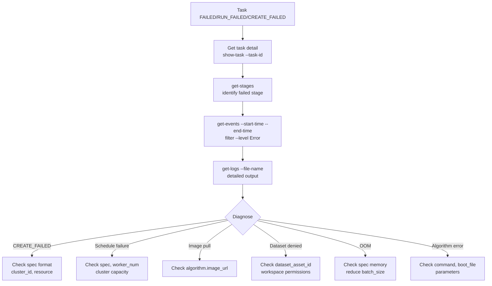
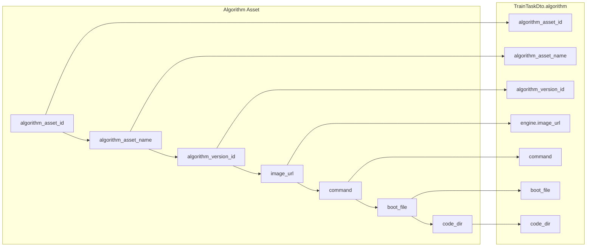

# Dataflow Diagram

## High-Level Architecture



## API Surface Routing (--sim-rl flag)

```mermaid
flowchart LR
    Cmd[CLI command] --> Flag{--sim-rl?}
    Flag -->|No| TrainAPI[/v1/training/train-tasks]
    Flag -->|Yes| SimAPI[/v1/training/rl-tasks/simulation]
    TrainAPI --> TrainClient[19 train_* SDK methods]
    SimAPI --> SimClient[16 sim_rl_* SDK methods]
```

## Task Lifecycle (16 states)



## Execution Stages (4 phases)



Each main stage contains `sub_stages[]` with name, en_message, zh_message, create_time.

## Fine-tuning Dataflow

```mermaid
flowchart LR
    subgraph Prepare
        P1[Query Base Model<br/>list-assets --type model] --> P2[Query Dataset<br/>list-assets --type dataset]
        P2 --> P3[Choose Method<br/>SFT/LORA/QLORA/DEEPSPEED]
        P3 --> P4[Choose Spec<br/>Ascend format string]
    end
    subgraph Execute
        E1[Create finetune task<br/>POST /v1/training/train-tasks<br/>train_mode=MODEL_TUNING] --> E2[Poll Status<br/>show-task 30-60s]
        E2 --> E3[Monitor Stages<br/>get-stages]
        E3 --> E4[FINISHED]
    end
    subgraph Export
        X1[Extract output_models] --> X2[Export via cloudrobo asset<br/>or deploy via cloudrobo-infer]
    end
    P4 --> E1
    E4 --> X1
```



## Pretrain Dataflow



## SimRL Dataflow (--sim-rl)

```mermaid
flowchart TD
    Start[SimRL task request] --> Create[create-task --sim-rl<br/>POST /v1/training/rl-tasks/simulation]
    Create --> Poll[Poll status<br/>show-task --sim-rl]
    Poll --> Monitor[Monitor<br/>get-stages --sim-rl<br/>get-resource-usage --sim-rl --metric --start --end<br/>get-events --sim-rl --start-time --end-time<br/>get-logs --sim-rl<br/>get-signed-url --sim-rl --file-source --file-name]
    Monitor --> Terminal{Terminal?}
    Terminal -->|No| Poll
    Terminal -->|Yes| Done[FINISHED/FAILED]
    Done --> Lifecycle[stop-task --sim-rl<br/>restart-task --sim-rl<br/>clone-task (SimRL-only)<br/>delete-tasks --sim-rl]
```

## Draft Dataflow (save & resubmit)



## Diagnosis Dataflow (failure analysis)



## Field Mapping Dataflow (Algorithm → TrainTaskDto.algorithm)


