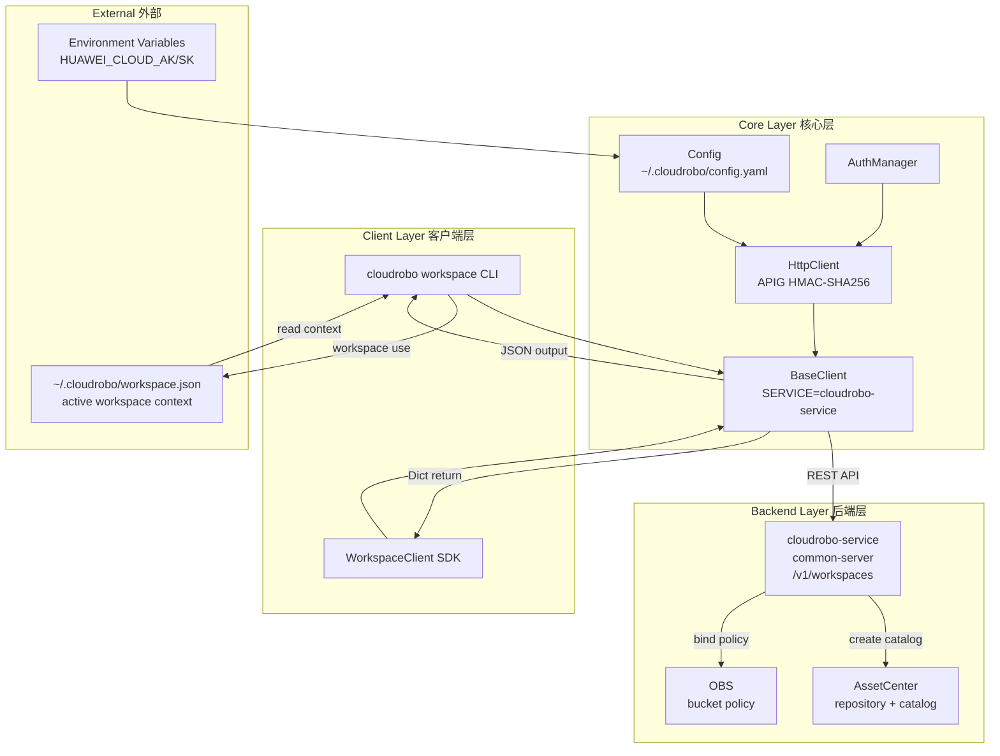
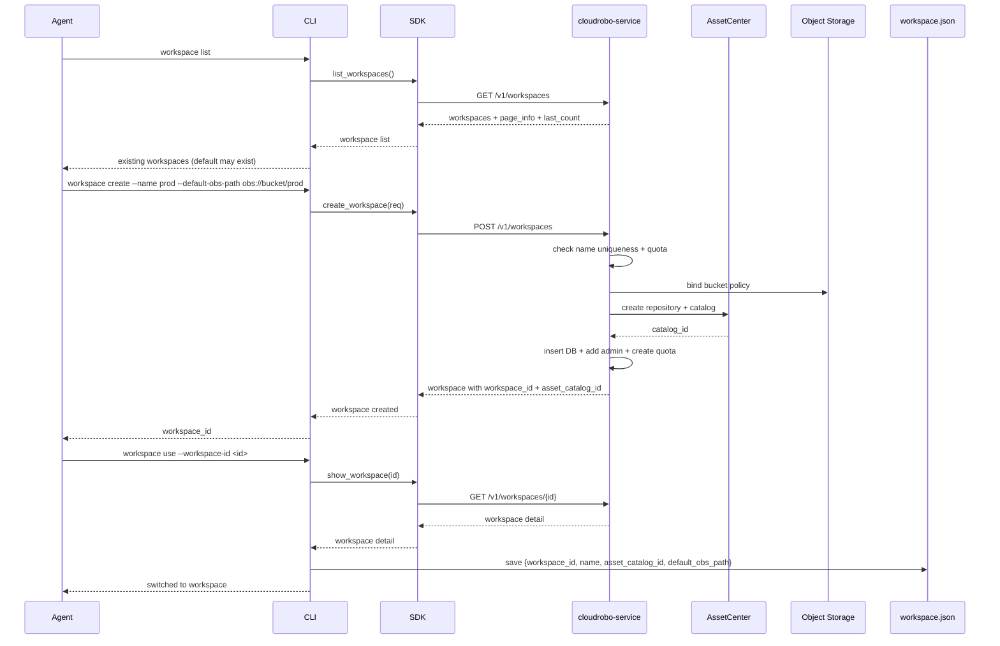
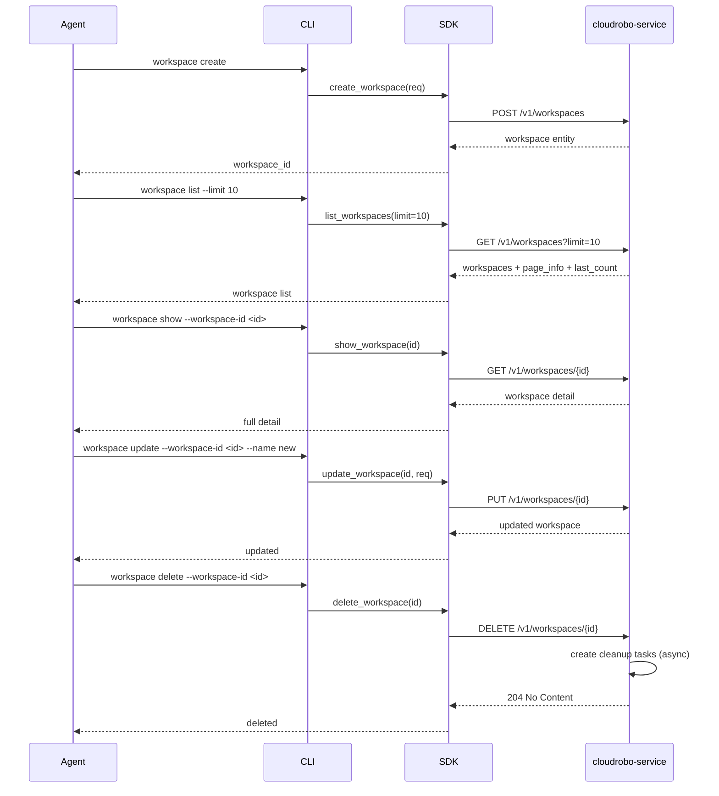
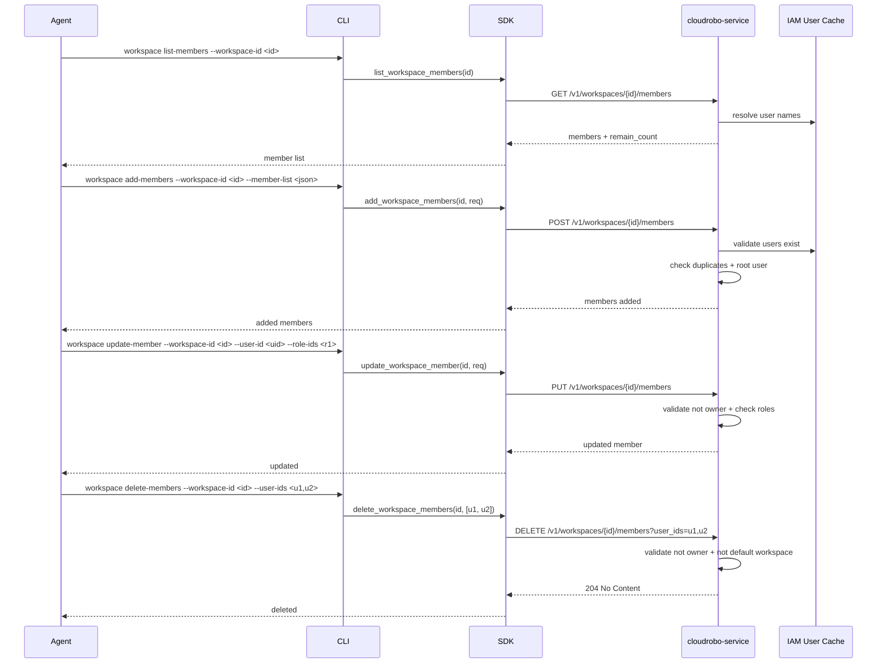
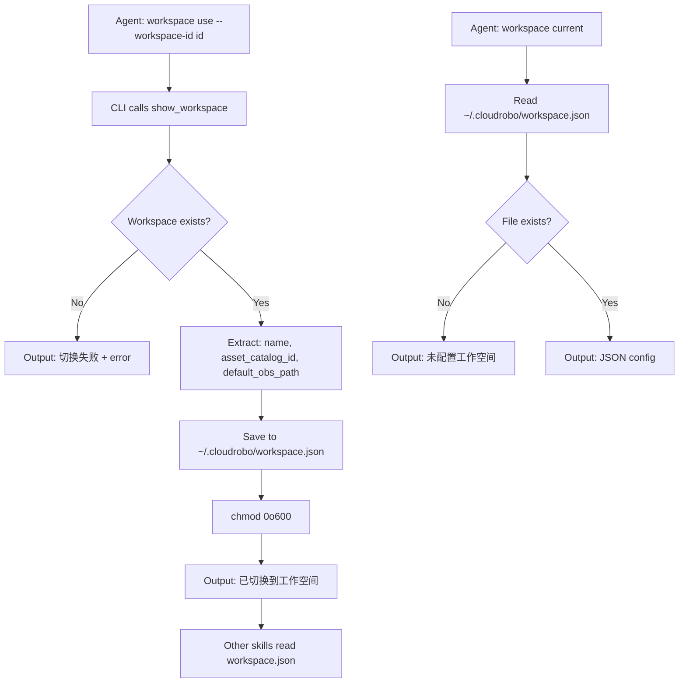

# Dataflow Diagram 数据流图

## Architecture Overview 架构概览

## Onboarding Flow 首次设置流程

## Workspace CRUD Flow 工作空间CRUD流程

## Member Management Flow 成员管理流程

## Workspace Context Switching Flow 工作空间切换流程

## API Path Summary API路径汇总

### Workspace

| Operation | Method | Path |
|-----------|--------|------|
| Create workspace | POST | `/v1/workspaces` |
| List workspaces | GET | `/v1/workspaces` |
| Show workspace | GET | `/v1/workspaces/{workspace_id}` |
| Update workspace | PUT | `/v1/workspaces/{workspace_id}` |
| Delete workspace | DELETE | `/v1/workspaces/{workspace_id}` |

### Members

| Operation | Method | Path |
|-----------|--------|------|
| Add members | POST | `/v1/workspaces/{workspace_id}/members` |
| List members | GET | `/v1/workspaces/{workspace_id}/members` |
| Update member | PUT | `/v1/workspaces/{workspace_id}/members` |
| Delete members | DELETE | `/v1/workspaces/{workspace_id}/members?user_ids=` |

### Overview

| Operation | Method | Path |
|-----------|--------|------|
| Get overview | GET | `/v1/workspaces/statistic/overview` |
